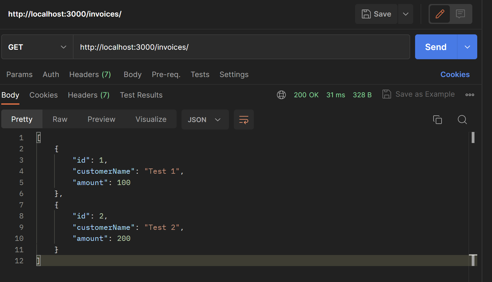

# TypeScript invoices
System for creating and processing invoices in TypeScript. Originally, I created a slightly more involved system, but I could not get my Mongodb cluster to work in time; now everything is in invoice.ts.

Instructions:
"npm start" in cmd to host on port 3000.

# Sample images
I used Postman to test with GET and POST requests.

Dependencies:

express - web application framework for Node.js; define HTTP routes, middleware functions, and other functionality to handle incoming requests and produce responses.

nodemon - automatically restart server when changes are made

<!-- mongoose -  schema/data definition, model creation for interfacing with data, validating data

body-parser - middleware to extract the payload of an HTTP request (typically encoded in JSON, URL-encoded or as a form data) and parses it into a JS object -->

